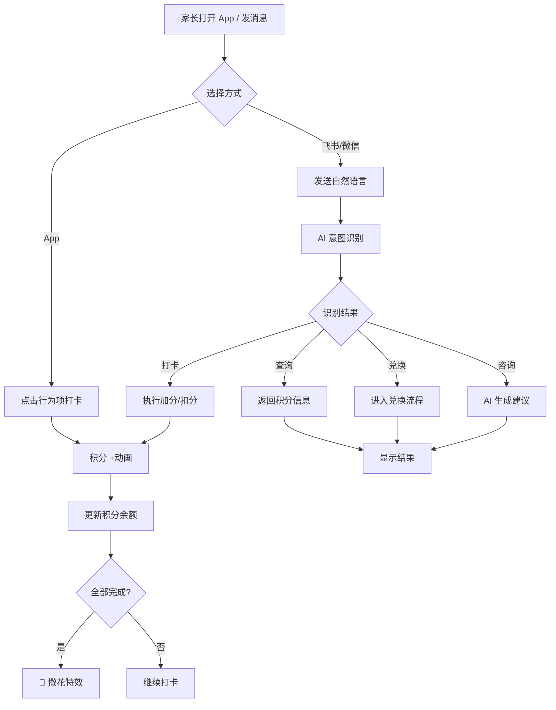
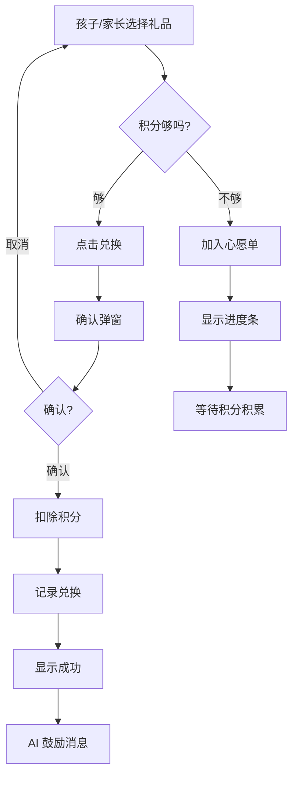
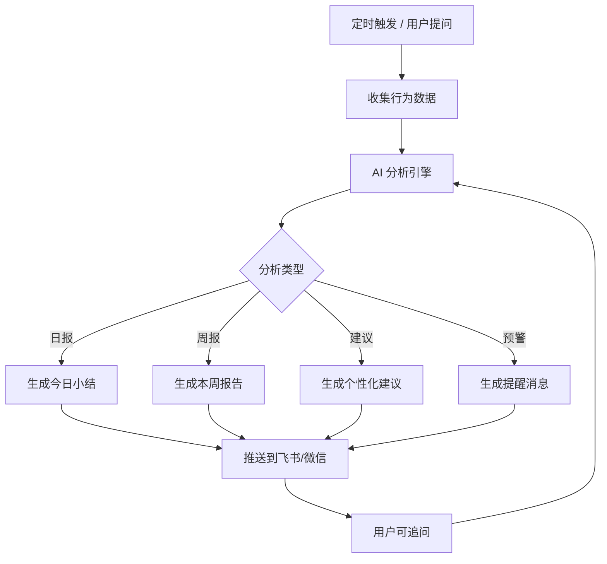

# UI 交互设计文档 — 小孩行为积分奖惩系统

> 版本: v0.1
> 日期: 2026-06-24
> 状态: 设计中

---

## 1. 设计原则

| 原则 | 说明 |
|------|------|
| 🎯 简单直觉 | 家长 3 秒内完成一次打卡操作 |
| 🌈 童趣友好 | 色彩明快、图标可爱、动画有趣 |
| 📱 多端一致 | App / 飞书 / 微信体验统一 |
| 👆 单手操作 | 核心功能支持单手拇指操作 |
| 💬 自然语言 | 能用说话解决的，就不用点击 |

---

## 2. 信息架构 (IA)

### 2.1 App 端页面结构

```
首页 (Home)
├── 今日打卡面板
│   ├── 固定行为列表（可滑动打卡）
│   ├── 今日积分概览
│   └── 连续打卡天数
├── 快速操作区
│   ├── + 自定义加分
│   └── - 自定义扣分
│
积分 (Points)
├── 积分余额（大数字展示）
├── 积分趋势图（周/月）
├── 积分流水明细
│   ├── 按日期分组
│   └── 每条记录：行为 + 积分 + 时间 + 备注
└── 积分筛选（加分/扣分/全部）
│
礼品商城 (Gifts)
├── 可兑换礼品列表
│   ├── 按分类筛选
│   ├── 按积分排序
│   └── 每个礼品：图标 + 名称 + 所需积分
├── 心愿单
│   └── 积分不够的礼品收藏
├── 兑换记录
│   └── 历史兑换列表 + 状态
└── 申请兑换按钮
│
成长报告 (Reports) — AI 驱动
├── AI 每日小结
├── 周报 / 月报
├── 行为分析雷达图
├── 习惯养成进度
├── 成就墙
│   └── 已解锁 / 未解锁成就
└── AI 建议卡片
│
我的 (Profile)
├── 孩子档案
│   ├── 头像 / 昵称 / 年龄
│   └── 切换孩子（多孩）
├── 行为管理
│   ├── 固定行为开关
│   ├── 自定义行为增删改
│   └── 积分值调整
├── 礼品管理
│   ├── 礼品库增删改
│   └── 积分值调整
├── 通知设置
│   ├── 打卡提醒时间
│   └── AI 报告推送时间
├── 渠道绑定
│   ├── 飞书账号
│   └── 微信账号
└── 数据导出
```

### 2.2 底部导航栏（App）

```
┌─────────────────────────────────────────────┐
│                                              │
│              (页面内容区域)                    │
│                                              │
├──────────┬──────────┬──────────┬─────────────┤
│   🏠     │   ⭐     │   🎁     │   📊        │
│   首页   │   积分   │   礼品   │   成长       │
└──────────┴──────────┴──────────┴─────────────┘
```

> 注：「我的」通过首页左上角孩子头像进入

---

## 3. 核心页面交互设计

### 3.1 首页 — 今日打卡

```
┌──────────────────────────────────┐
│  👦 小明  ▾          🔔  ⚙️     │  ← 顶部：孩子切换 + 通知 + 设置
├──────────────────────────────────┤
│                                  │
│  ┌──────────────────────────┐    │
│  │      ⭐ 85 积分           │    │  ← 积分卡片（大数字）
│  │  🔥 连续打卡 5 天          │    │
│  └──────────────────────────┘    │
│                                  │
│  📅 今日任务              6/7 ✅ │  ← 进度指示
│  ─────────────────────────────   │
│                                  │
│  ┌──────────────────────────┐    │
│  │ 🌅 起床洗漱        +2  ✅ │    │  ← 已完成（绿色勾）
│  ├──────────────────────────┤    │
│  │ 🥣 早餐            +1  ✅ │    │
│  ├──────────────────────────┤    │
│  │ 📚 学习/作业       +3  ✅ │    │
│  ├──────────────────────────┤    │
│  │ 🍱 中午吃饭        +1  ✅ │    │
│  ├──────────────────────────┤    │
│  │ 🍽️ 晚上吃饭       +1  ✅ │    │
│  ├──────────────────────────┤    │
│  │ 🪥 晚上洗漱        +2  ⬜ │    │  ← 未完成（点击打卡）
│  ├──────────────────────────┤    │
│  │ 😴 睡觉            +2  ⬜ │    │
│  └──────────────────────────┘    │
│                                  │
│  ┌──────┐  ┌──────┐  ┌──────┐   │
│  │ 📖   │  │ 🏃   │  │  +   │   │  ← 快捷加分（自定义行为）
│  │阅读+3│  │运动+3│  │ 更多  │   │
│  └──────┘  └──────┘  └──────┘   │
│                                  │
│  ┌──────────────────────────┐    │
│  │ 💬 跟 AI 聊聊小明的表现   │    │  ← AI 入口
│  └──────────────────────────┘    │
│                                  │
├──────────┬──────────┬──────────┬─┤
│   🏠     │   ⭐     │   🎁    │📊│
│   首页   │   积分   │   礼品  │成长│
└──────────┴──────────┴──────────┴─┘
```

**交互说明：**

| 操作 | 行为 | 反馈 |
|------|------|------|
| 点击行为项右侧 ⬜ | 标记完成，+积分 | 卡片变绿 ✅，顶部积分数字跳动 +动画 |
| 长按行为项 | 弹出操作菜单 | 撤销 / 修改积分 / 添加备注 |
| 点击快捷行为按钮 | 直接加分 | 弹出确认气泡，确认后加分 |
| 点击 + 更多 | 展开全部自定义行为 | 底部弹出行为选择面板 |
| 点击孩子头像/名字 | 切换孩子 | 下拉选择器，切换后页面数据刷新 |
| 点击 AI 入口 | 进入 AI 对话 | 跳转到 AI 对话页面 |

**打卡动画：**
- 点击打卡后，积分数字从 85 → 87 有滚动动画
- 同时有星星飞入效果 ✨
- 如果完成全部任务，触发撒花特效 🎉

### 3.2 积分页 — 明细与趋势

```
┌──────────────────────────────────┐
│  ⭐ 积分                         │
├──────────────────────────────────┤
│                                  │
│  ┌──────────────────────────┐    │
│  │        85 积分             │    │
│  │  今日 +10  │  本周 +58     │    │
│  └──────────────────────────┘    │
│                                  │
│  ┌──────────────────────────┐    │
│  │  📈 积分趋势              │    │
│  │     ╱╲   ╱╲              │    │  ← 折线图
│  │   ╱    ╲╱   ╲            │    │
│  │  一 二 三 四 五 六 日      │    │
│  └──────────────────────────┘    │
│                                  │
│  [全部] [加分] [扣分]            │  ← 筛选标签
│                                  │
│  📅 今天                         │
│  ┌──────────────────────────┐    │
│  │ 🪥 晚上洗漱       +2     │    │
│  │    19:30                  │    │
│  ├──────────────────────────┤    │
│  │ 📖 课外阅读       +3     │    │
│  │    17:00  备注: 读了30分钟 │    │
│  ├──────────────────────────┤    │
│  │ 😤 发脾气         -2     │    │  ← 扣分红色
│  │    15:00  备注: 因为看电视 │    │
│  └──────────────────────────┘    │
│                                  │
│  📅 昨天                         │
│  ┌──────────────────────────┐    │
│  │ ...                       │    │
│  └──────────────────────────┘    │
│                                  │
└──────────────────────────────────┘
```

**交互说明：**

| 操作 | 行为 |
|------|------|
| 点击筛选标签 | 切换显示全部/仅加分/仅扣分 |
| 左滑积分记录 | 显示删除/修改按钮 |
| 点击某条记录 | 展开详情 + 编辑备注 |
| 长按日期标题 | 批量操作（全选/删除） |

### 3.3 礼品商城

```
┌──────────────────────────────────┐
│  🎁 礼品商城                      │
├──────────────────────────────────┤
│                                  │
│  当前积分: ⭐ 85                  │
│                                  │
│  [全部] [娱乐] [食物] [外出]      │  ← 分类筛选
│  [学习] [礼物] [特别]             │
│                                  │
│  ┌────────┐  ┌────────┐          │
│  │ 📺     │  │ 🍪     │          │
│  │看动画片 │  │小零食   │          │
│  │30分钟   │  │        │          │
│  │ ⭐ 10   │  │ ⭐ 15  │          │
│  │[兑换]   │  │ [兑换]  │          │
│  └────────┘  └────────┘          │
│                                  │
│  ┌────────┐  ┌────────┐          │
│  │ 🏞️    │  │ 📚     │          │
│  │去公园   │  │买新书   │          │
│  │        │  │        │          │
│  │ ⭐ 30  │  │ ⭐ 50  │          │
│  │[兑换]   │  │ [兑换]  │          │
│  └────────┘  └────────┘          │
│                                  │
│  ┌────────┐  ┌────────┐          │
│  │ 🎮     │  │ 🎢     │          │
│  │买玩具   │  │游乐园   │          │
│  │50元内   │  │        │          │
│  │⭐ 100  │  │ ⭐ 200 │          │
│  │[积分不足│  │[加入心  │          │  ← 积分不够时的状态
│  │ 心愿单] │  │ 愿单]   │          │
│  └────────┘  └────────┘          │
│                                  │
│  💝 心愿单 (3)                    │
│  ┌──────────────────────────┐    │
│  │ 🎮 买玩具  还差 15 积分    │    │  ← 进度条
│  │ ████████████░░░  85/100   │    │
│  └──────────────────────────┘    │
│                                  │
└──────────────────────────────────┘
```

**兑换流程弹窗：**

```
┌──────────────────────────────────┐
│                                  │
│    ┌──────────────────────┐      │
│    │                      │      │
│    │   📚 买一本新书       │      │
│    │                      │      │
│    │   需要: ⭐ 50 积分    │      │
│    │   当前: ⭐ 85 积分    │      │
│    │   兑换后: ⭐ 35 积分  │      │
│    │                      │      │
│    │  ┌──────────────────┐│      │
│    │  │   ✅ 确认兑换     ││      │
│    │  └──────────────────┘│      │
│    │  ┌──────────────────┐│      │
│    │  │   取消           ││      │
│    │  └──────────────────┘│      │
│    └──────────────────────┘      │
│                                  │
└──────────────────────────────────┘
```

### 3.4 成长报告 — AI 驱动

```
┌──────────────────────────────────┐
│  📊 成长报告                      │
├──────────────────────────────────┤
│                                  │
│  🤖 AI 今日小结                   │
│  ┌──────────────────────────┐    │
│  │ 小明今天表现很棒！完成了     │    │
│  │ 6/7 项日常任务，还主动阅读   │    │
│  │ 了30分钟课外书 📖           │    │
│  │                           │    │
│  │ 💡 建议：睡觉时间可以再早    │    │
│  │ 一点，试试 9 点上床？       │    │
│  │                           │    │
│  │ [查看详情]  [💬 问问AI]    │    │
│  └──────────────────────────┘    │
│                                  │
│  📈 行为雷达图                    │
│  ┌──────────────────────────┐    │
│  │        生活习惯            │    │
│  │         ╱╲               │    │
│  │   学习 ╱    ╲ 运动        │    │  ← 五维雷达图
│  │      ╲      ╱            │    │
│  │       ╲    ╱             │    │
│  │        品德              │    │
│  │                          │    │
│  │  生活: 85  学习: 70       │    │
│  │  运动: 60  品德: 90       │    │
│  │  创意: 75                │    │
│  └──────────────────────────┘    │
│                                  │
│  🏅 习惯养成进度                  │
│  ┌──────────────────────────┐    │
│  │ 😴 按时睡觉  ████████░ 28/30│   │  ← 即将达成！
│  │ 🌅 按时起床  ██████░░░ 21/30│   │
│  │ 📚 每日阅读  ████░░░░░ 12/30│   │
│  │ 🪥 按时洗漱  █████████ 30/30│   │  ← 已达成 ✅
│  └──────────────────────────┘    │
│                                  │
│  🏆 成就墙                       │
│  ┌──────────────────────────┐    │
│  │ 🏅 🏆 ⭐ 🎖️ 💎 🌈       │    │
│  │ ✅  ✅  ✅  ✅  🔒 🔒    │    │  ← 已解锁 + 未解锁
│  └──────────────────────────┘    │
│                                  │
│  [📅 周报]  [📅 月报]            │
│                                  │
└──────────────────────────────────┘
```

### 3.5 AI 对话页面

```
┌──────────────────────────────────┐
│  ← 🤖 AI 成长助手    小明 ▾      │
├──────────────────────────────────┤
│                                  │
│  ┌──────────────────────────┐    │
│  │ 🤖 早上好！小明昨天表现     │    │
│  │ 不错，完成了 6/7 项任务。   │    │
│  │ 今天也要加油哦！💪         │    │
│  └──────────────────────────┘    │
│                                  │
│  ┌──────────────────────────┐    │
│  │ 👤 小明最近学习怎么样？    │    │
│  └──────────────────────────┘    │
│                                  │
│  ┌──────────────────────────┐    │
│  │ 🤖 小明这周学习方面：       │    │
│  │                           │    │
│  │ 📊 作业完成率: 80%         │    │
│  │ 📖 课外阅读: 4次/7天       │    │
│  │                           │    │
│  │ 💡 建议:                  │    │
│  │ 阅读习惯不错，可以尝试让     │    │
│  │ 小明自己选书，增加兴趣。     │    │
│  │ 作业方面，建议固定一个       │    │
│  │ 安静的学习时间段。          │    │
│  │                           │    │
│  │ 需要我帮你制定一个学习      │    │
│  │ 计划吗？                   │    │
│  └──────────────────────────┘    │
│                                  │
│  ┌──────────────────────────┐    │
│  │ 👤 好的，帮我制定一个      │    │
│  │                            │    │
│  ┌──────────────────────────┐    │
│  │ 🤖 给小明的学习计划：       │    │
│  │                           │    │
│  │ 📅 周一至周五              │    │
│  │ • 16:00-17:00 写作业       │    │
│  │ • 17:00-17:30 课外阅读     │    │
│  │ • 完成后各 +3 积分         │    │
│  │                           │    │
│  │ 要不要把这个计划添加到      │    │
│  │ 每日任务里？               │    │
│  │                           │    │
│  │ [✅ 添加到任务] [❌ 先不了] │    │  ← 快捷操作按钮
│  └──────────────────────────┘    │
│                                  │
├──────────────────────────────────┤
│ 💬 输入消息...          📤       │
└──────────────────────────────────┘
```

### 3.6 孩子档案页

```
┌──────────────────────────────────┐
│  ← 孩子档案                      │
├──────────────────────────────────┤
│                                  │
│         ┌──────────┐             │
│         │  👦      │             │
│         │ (头像)    │             │
│         └──────────┘             │
│         小明                      │
│         7 岁 · 一年级              │
│         ⭐ 85 积分                │
│                                  │
│  ─────────────────────────────   │
│                                  │
│  📋 行为管理                     │
│  ┌──────────────────────────┐    │
│  │ 🌅 起床洗漱    +2    🔵  │    │  ← 开关
│  │ 🥣 早餐        +1    🔵  │    │
│  │ 📚 学习/作业   +3    🔵  │    │
│  │ 🍱 中午吃饭    +1    🔵  │    │
│  │ 🍽️ 晚上吃饭   +1    🔵  │    │
│  │ 🪥 晚上洗漱    +2    🔵  │    │
│  │ 😴 睡觉        +2    🔵  │    │
│  │ 📖 课外阅读    +3    🔵  │    │
│  │              [+ 添加行为] │    │
│  └──────────────────────────┘    │
│                                  │
│  🎁 礼品管理                     │
│  ┌──────────────────────────┐    │
│  │ 📺 看动画片    10分   🔵  │    │
│  │ 🍪 小零食      15分   🔵  │    │
│  │ 🏞️ 去公园     30分   🔵  │    │
│  │ 📚 买新书      50分   🔵  │    │
│  │              [+ 添加礼品] │    │
│  └──────────────────────────┘    │
│                                  │
│  ⚙️ 设置                        │
│  ┌──────────────────────────┐    │
│  │ 每日积分上限     30       │    │
│  │ 打卡提醒时间    20:00     │    │
│  │ AI 报告时间     21:00     │    │
│  └──────────────────────────┘    │
│                                  │
└──────────────────────────────────┘
```

---

## 4. 飞书 / 微信交互设计

### 4.1 飞书机器人交互

#### 4.1.1 打卡交互

```
┌──────────────────────────────────────────┐
│  家长                                     │
│  "小明今天按时起床了"                       │
└──────────────────────────────────────────┘
                    ↓
┌──────────────────────────────────────────┐
│  🤖 积分小助手                             │
│                                          │
│  ✅ 已记录！                              │
│  ┌────────────────────────────────┐      │
│  │ 👦 小明  🌅 起床洗漱  +2        │      │
│  │                                │      │
│  │ 今日积分: 12/20                │      │
│  │ 总积分: ⭐ 87                  │      │
│  └────────────────────────────────┘      │
└──────────────────────────────────────────┘
```

#### 4.1.2 查询交互

```
┌──────────────────────────────────────────┐
│  家长                                     │
│  "小明现在多少积分"                         │
└──────────────────────────────────────────┘
                    ↓
┌──────────────────────────────────────────┐
│  🤖 积分小助手                             │
│                                          │
│  👦 小明的积分概况                         │
│  ┌────────────────────────────────┐      │
│  │ 总积分: ⭐ 85                   │      │
│  │ 今日: +10                       │      │
│  │ 本周: +58                       │      │
│  │ 🔥 连续打卡: 5 天               │      │
│  │                                │      │
│  │ 📊 今日完成: 6/7               │      │
│  │ ⬜ 晚上洗漱                     │      │
│  │ ⬜ 睡觉                        │      │
│  │                                │      │
│  │ 🎯 最近目标: 买新书 (还差35分)   │      │
│  └────────────────────────────────┘      │
└──────────────────────────────────────────┘
```

#### 4.1.3 兑换交互

```
┌──────────────────────────────────────────┐
│  家长                                     │
│  "小明想换一本新书"                         │
└──────────────────────────────────────────┘
                    ↓
┌──────────────────────────────────────────┐
│  🤖 积分小助手                             │
│                                          │
│  🎁 兑换确认                              │
│  ┌────────────────────────────────┐      │
│  │ 📚 买一本新书                   │      │
│  │ 需要: 50 积分                   │      │
│  │ 当前: 85 积分                   │      │
│  │ 兑换后: 35 积分                 │      │
│  │                                │      │
│  │ [✅ 确认兑换] [❌ 取消]          │      │  ← 飞书卡片按钮
│  └────────────────────────────────┘      │
└──────────────────────────────────────────┘
                    ↓ (家长点击确认)
┌──────────────────────────────────────────┐
│  🤖 积分小助手                             │
│                                          │
│  🎉 兑换成功！                             │
│  ┌────────────────────────────────┐      │
│  │ 📚 买一本新书                   │      │
│  │ 扣除: -50 积分                  │      │
│  │ 剩余: ⭐ 35 积分                │      │
│  │                                │      │
│  │ 记得带小明去选书哦！📖           │      │
│  └────────────────────────────────┘      │
└──────────────────────────────────────────┘
```

#### 4.1.4 AI 建议交互

```
┌──────────────────────────────────────────┐
│  家长                                     │
│  "小明最近不爱睡觉怎么办"                    │
└──────────────────────────────────────────┘
                    ↓
┌──────────────────────────────────────────┐
│  🤖 积分小助手                             │
│                                          │
│  💡 关于小明睡觉的建议                      │
│  ┌────────────────────────────────┐      │
│  │                                │      │
│  │ 📊 数据分析:                    │      │
│  │ 最近 7 天，按时睡觉 4 次         │      │
│  │ 比上周 (6/7) 有所下降            │      │
│  │                                │      │
│  │ 🧐 可能原因:                    │      │
│  │ 1. 晚上活动太兴奋               │      │
│  │ 2. 睡前看了刺激的内容            │      │
│  │ 3. 卧室环境不够舒适              │      │
│  │                                │      │
│  │ 💡 建议:                        │      │
│  │ 1. 睡前 30 分钟改为安静活动      │      │
│  │    (阅读/听故事)                │      │
│  │ 2. 可以加一个"提前睡觉奖励"      │      │
│  │    9点前睡 +1 额外积分           │      │
│  │ 3. 让小明自己选一个小夜灯        │      │
│  │                                │      │
│  │ 需要我帮你添加这个额外奖励       │      │
│  │ 规则吗？                        │      │
│  │                                │      │
│  │ [✅ 添加规则] [🤔 再想想]       │      │
│  └────────────────────────────────┘      │
└──────────────────────────────────────────┘
```

#### 4.1.5 AI 主动推送（每日报告）

```
┌──────────────────────────────────────────┐
│  🤖 积分小助手                    21:00   │
│                                          │
│  📊 小明今日成长报告                       │
│  ┌────────────────────────────────┐      │
│  │                                │      │
│  │ 📅 2026-06-24  周三             │      │
│  │                                │      │
│  │ ⭐ 今日积分: +15               │      │
│  │ 📊 任务完成: 7/7 🎉            │      │
│  │ 🔥 连续打卡: 6 天              │      │
│  │                                │      │
│  │ 🌟 今日亮点:                    │      │
│  │ • 主动帮忙洗碗 (+2)             │      │
│  │ • 课外阅读 40 分钟 (+3)         │      │
│  │                                │      │
│  │ 💡 明日建议:                    │      │
│  │ 小明最近阅读习惯很好，可以        │      │
│  │ 试试让他给家人讲故事，            │      │
│  │ 锻炼表达能力。                   │      │
│  │                                │      │
│  │ [查看详情] [💬 聊聊]            │      │
│  └────────────────────────────────┘      │
└──────────────────────────────────────────┘
```

### 4.2 微信端交互

微信端交互与飞书基本一致，区别在于：
- 使用微信卡片消息格式
- 支持公众号菜单快捷入口
- 模板消息推送（需用户授权）

---

## 5. 关键交互流程

### 5.1 每日打卡流程



### 5.2 礼品兑换流程



### 5.3 AI 分析流程



---

## 6. 设计系统

### 6.1 色彩规范

```
主色调:
  主色     #4CAF50  (绿色 — 成长、积极)
  辅助色   #FF9800  (橙色 — 活力、奖励)
  强调色   #2196F3  (蓝色 — 信息、AI)

语义色:
  加分     #4CAF50  (绿色)
  扣分     #F44336  (红色)
  成功     #4CAF50
  警告     #FF9800
  错误     #F44336
  信息     #2196F3

背景色:
  主背景   #F5F5F5
  卡片背景 #FFFFFF
  深色背景 #1A1A2E  (暗色模式)

积分相关:
  积分金   #FFD700  (金色星星)
  连打卡   #FF5722  (火焰橙)
```

### 6.2 字体规范

```
标题:
  大标题    24sp  Bold
  标题      20sp  SemiBold
  小标题    16sp  Medium

正文:
  正文      14sp  Regular
  辅助文字  12sp  Regular
  小字      10sp  Regular

数字:
  积分大数字  36sp  Bold (DIN / Roboto Mono)
  积分中数字  24sp  Bold
  积分小数字  16sp  Medium
```

### 6.3 图标系统

使用 Emoji + 自定义图标结合：
- 行为项：Emoji（直觉、跨文化）
- 功能按钮：Material Icons（统一、清晰）
- AI 相关：自定义机器人图标

### 6.4 圆角规范

```
小组件 (标签、按钮):  8dp
卡片:                 12dp
弹窗:                 16dp
头像:                 全圆
```

### 6.5 间距规范

```
页面边距:     16dp
卡片内边距:   12dp
列表项间距:    8dp
区块间距:      24dp
```

---

## 7. 动效设计

### 7.1 打卡动效

| 触发 | 动效 | 时长 |
|------|------|------|
| 点击打卡 | 卡片从白变绿 + ✅ 弹入 | 300ms |
| 积分增加 | 数字滚动 + ✨ 粒子飞入 | 500ms |
| 全部完成 | 全屏撒花 🎉 | 1500ms |
| 扣分 | 卡片短暂抖动 + 红色闪烁 | 400ms |

### 7.2 转场动效

| 场景 | 动效 |
|------|------|
| 页面切换 | 共享元素转场（积分数字） |
| 弹窗出现 | 从底部滑入 + 背景模糊 |
| AI 回复 | 打字机效果（逐字显示） |
| 礼品兑换 | 礼品图标飞入 + 星星爆炸 |

### 7.3 加载状态

```
骨架屏 (Skeleton):
  首页加载 → 显示打卡列表骨架
  积分页加载 → 显示图表骨架
  报告加载 → 显示文本骨架 + "AI 正在思考..."

下拉刷新:
  自定义动画 — 星星旋转
```

---

## 8. 多孩切换交互

```
┌──────────────────────────────────┐
│  👦 小明  ▾          🔔  ⚙️     │  ← 点击名字/头像
├──────────────────────────────────┤
│                                  │
│  ┌──────────────────────────┐    │
│  │ 👦 小明  ⭐85  🔥5天      │    │  ← 当前选中
│  ├──────────────────────────┤    │
│  │ 👧 小红  ⭐120  🔥12天    │    │
│  ├──────────────────────────┤    │
│  │ 👶 小宝  ⭐30   🔥2天     │    │
│  ├──────────────────────────┤    │
│  │      [+ 添加孩子]         │    │
│  └──────────────────────────┘    │
│                                  │
└──────────────────────────────────┘
```

切换时：
- 顶部孩子信息平滑切换
- 页面数据带滑动动画刷新
- 积分数字重新滚动

---

## 9. 空状态设计

| 页面 | 空状态 | 引导 |
|------|--------|------|
| 积分流水 | 📝 还没有积分记录 | "快去打卡吧！" + 按钮 |
| 礼品商城 | 🎁 还没有礼品 | "添加第一个礼品" + 按钮 |
| 成长报告 | 📊 数据积累中... | "再坚持几天就能看到报告啦" |
| 成就墙 | 🏅 继续努力！ | "完成 7 天打卡获得第一个成就" |
| 心愿单 | 💭 心愿单是空的 | "去礼品商城看看有什么想要的" |

---

## 10. 响应式适配

### 10.1 手机 (< 600dp)
- 单列布局
- 底部导航栏
- 礼品商城 2 列网格

### 10.2 平板 (600-1200dp)
- 双列布局（左侧导航 + 右侧内容）
- 礼品商城 3-4 列网格
- 报告页图表更大

---

## 变更记录

| 日期 | 版本 | 变更内容 |
|------|------|----------|
| 2026-06-24 | v0.1 | 初始 UI 交互设计 |
